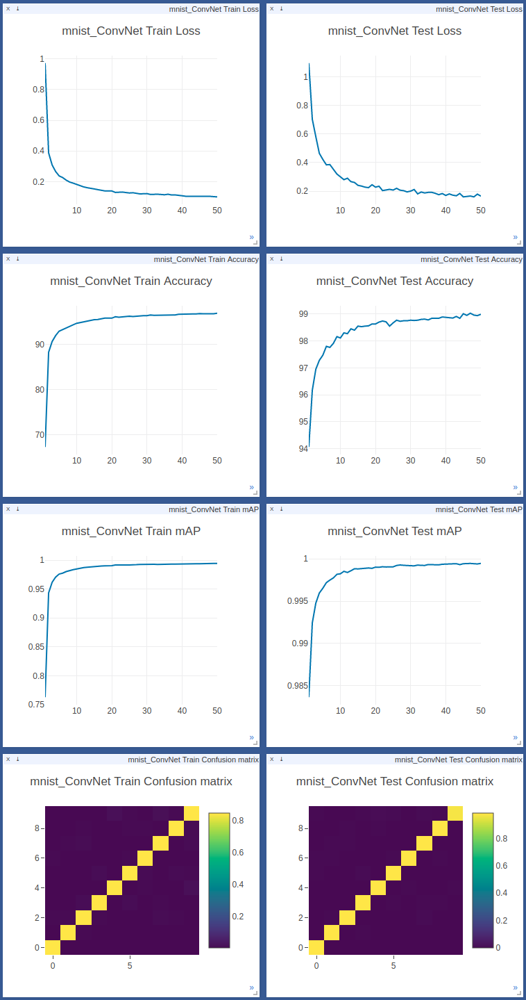

# pytorch_online_ploter
Online meter ploter for pytorch. Real time ploting Accuracy, Loss, mAP, AUC, Confusion Matrix 

## Start Visdom on a server

```bash
python -m visdom.server
# python -m visdom.server -port 9999 # to specify port to ex, 9999
```

## Basic MNIST Example

```bash
pip install -r requirements.txt
python mnist.py
# CUDA_VISIBLE_DEVICES=1 python mnist.py  # to specify GPU id to ex. 1

# if you run Visdom with 9999
# python mnist.py --port 9999
```

## Multi-meter

Easy to plot multi-meter with just one-line code:

### Plotting Accuracy, mAP

```python
mlog.update_meter(output, target, meters={'accuracy', 'map'})
```

### Plotting Loss Curve

```python
# NLL Loss
nll_loss = F.nll_loss(output, target)
mlog.update_loss(nll_loss, meter='nll_loss')

# Cross Entropy Loss
ce_loss = F.cross_entropy(output, target)
mlog.update_loss(ce_loss, meter='ce_loss')
```

## Remote Plotting

```python
mlog = MeterLogger(server="Server's IP", nclass=10, title="mnist")
```

## Real time plotting 

Open your browser with URL: 
```bash
http://localhost:9999
# or
http://ip:9999
```


